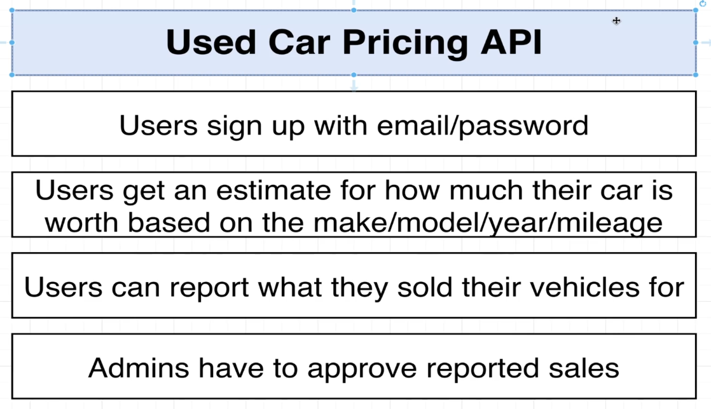
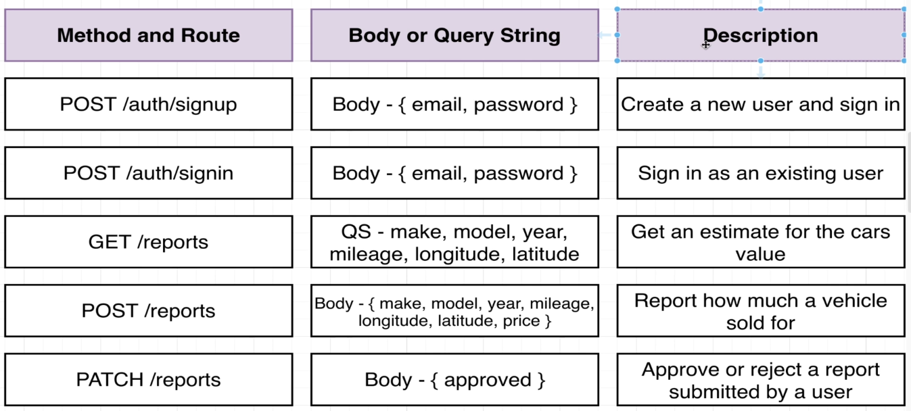
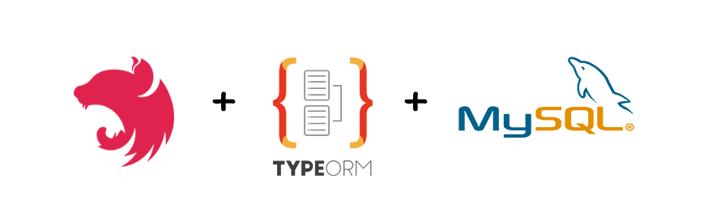

<p align="center">
  </a>
</p>
<br>

<p style="padding: 25px;">
<br>


<p align="center">

[](https://github.com/TheGreatJordach/used-car-pricing-api/actions/workflows/github-ci.yml)
[](https://sonarcloud.io/summary/new_code?id=TheGreatJordach_used-car-pricing-api)
[](https://sonarcloud.io/summary/new_code?id=TheGreatJordach_used-car-pricing-api)
[](https://sonarcloud.io/summary/new_code?id=TheGreatJordach_used-car-pricing-api)
[](https://sonarcloud.io/summary/new_code?id=TheGreatJordach_used-car-pricing-api)
[](https://sonarcloud.io/summary/new_code?id=TheGreatJordach_used-car-pricing-api)
[](https://sonarcloud.io/summary/new_code?id=TheGreatJordach_used-car-pricing-api)
[](https://sonarcloud.io/summary/new_code?id=TheGreatJordach_used-car-pricing-api)
[](https://sonarcloud.io/summary/new_code?id=TheGreatJordach_used-car-pricing-api)
[](https://sonarcloud.io/summary/new_code?id=TheGreatJordach_used-car-pricing-api)
</p>


# NestJS Car Price Estimation API

<p >
  </a>
</p>


## Description
The Used Car API is a simple demonstration project built with NestJS. This project showcases the use of modules and dependency injection in a NestJS application by providing a basic API for managing user authentication and car sales reports.

## Requirement
>This NestJS-based API provides a platform for users to estimate the potential selling price of their cars. By inputting details like make, model, year, mileage, and other relevant factors, users can receive a price estimate. Once a user successfully sells their car, they can submit a report detailing the final selling price.

<p >
  </a>
</p>

## Key Features:

* **Price Estimation**: Accurate car price estimation based on user-provided information.
* **User Reports**: Users can submit reports of their sold vehicles, contributing to the API's accuracy.
* **Admin Review**: Admin users can review and approve or reject user reports to ensure data integrity.
* **Data-Driven Improvement**: The API continuously learns from submitted reports, refining its price estimation algorithms.
* **Robust Backend**: Built on the NestJS framework for a scalable and maintainable architecture.

## API Endpoints:
* POST /auth/signup
    * Description: Create a new user account and sign in.
    * Body: `{ email, password }`
* POST /auth/signin
    * Description: Sign in as an existing user.
    * Body: `{ email, password }``
* GET /reports
    * Description: Get an estimate for the value of a car based on query parameters.
    * Query Parameters: `make, model, year, mileage, longitude, latitude`
* POST /reports
    * Description: Submit a report on how much a vehicle was sold for.
    * Body: `{ make, model, year, mileage, longitude, latitude, price }`
* PATCH /reports/
    * Description: Approve or reject a report submitted by a user (admin only).
    * Body: `{ approved }`

<p >
  </a>
</p>


##  Technologies:

* NestJS
* TypeScript
* [Database (e.g., PostgreSQL, MongoDB)]
* [ORM (e.g., TypeORM, Mongoose)]
* [Authentication/Authorization (e.g., JWT)]

## Technical Overview:
This project is organized into several modules, each responsible for a specific aspect of the application:

* Auth Module: Handles user authentication (sign-up and sign-in).
* Reports Module: Manages the creation, retrieval, and approval of car sales reports.
* Admin Module: Provides functionality for reviewing and approving user-submitted reports.

Each module is self-contained, promoting a modular architecture and enabling easy scaling and maintenance.

## Stack 

<p align="center">
  </a>
</p>

[circleci-image]: https://img.shields.io/circleci/build/github/nestjs/nest/master?token=abc123def456
[circleci-url]: https://circleci.com/gh/nestjs/nest

## Clone the repo

```bash
$ git clone git@github.com:TheGreatJordach/used-car-pricing-api.git
```

## Install dependencies

```bash
$ yarn install
```

## Running the app

```bash
# development
$ yarn run start

# watch mode
$ yarn run start:dev

# production mode
$ yarn run start:prod
```

## Test

```bash
# unit tests
$ yarn run test

# e2e tests
$ yarn run test:e2e

# test coverage
$ yarn run test:cov
```

## Support

Nest is an MIT-licensed open source project. It can grow thanks to the sponsors and support by the amazing backers. If you'd like to join them, please [read more here](https://docs.nestjs.com/support).

## Stay in touch

- Author - [Connect with me on LinkedIn](https://www.linkedin.com/in/jordachmakaya/)
- View   - [my Credly profile](https://www.credly.com/users/jordach-makaya)

## License

Nest is [MIT licensed](LICENSE).


</p>
